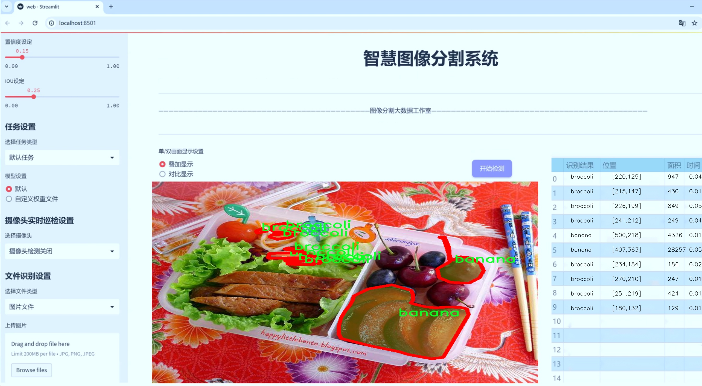
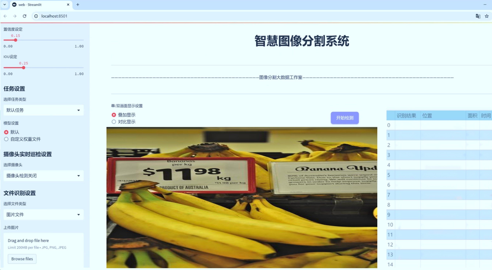
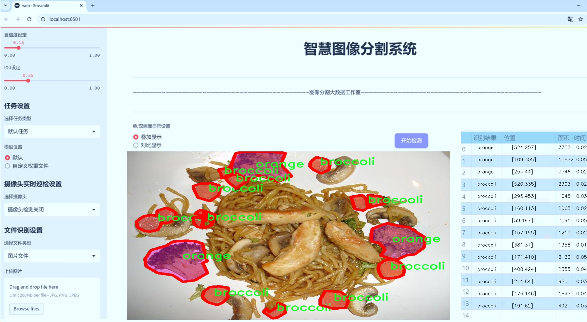
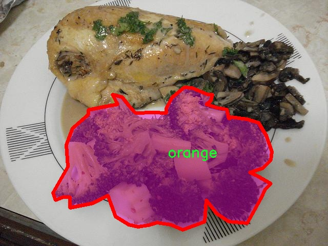
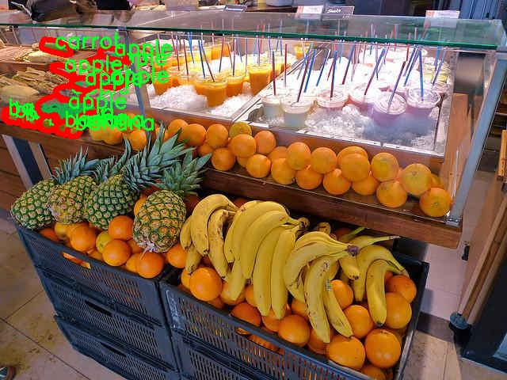
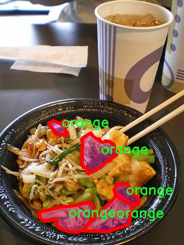
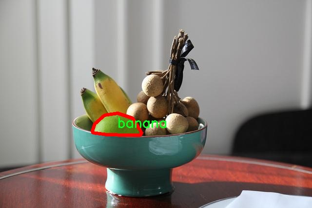
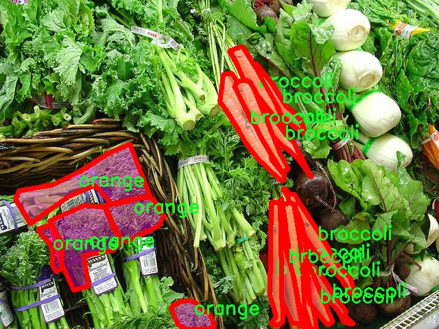

# 食品项图像分割系统源码＆数据集分享
 [yolov8-seg-EfficientHead＆yolov8-seg-p6等50+全套改进创新点发刊_一键训练教程_Web前端展示]

### 1.研究背景与意义

项目参考[ILSVRC ImageNet Large Scale Visual Recognition Challenge](https://gitee.com/YOLOv8_YOLOv11_Segmentation_Studio/projects)

项目来源[AAAI Global Al lnnovation Contest](https://kdocs.cn/l/cszuIiCKVNis)

研究背景与意义

随着科技的不断进步，计算机视觉技术在各个领域的应用日益广泛，尤其是在食品安全、智能零售和农业管理等领域。食品项图像分割作为计算机视觉中的一个重要研究方向，旨在从复杂的图像中准确识别和分割出不同的食品项，进而为后续的分析和处理提供基础。近年来，深度学习技术的迅猛发展为图像分割任务提供了强大的工具，尤其是YOLO（You Only Look Once）系列模型，以其高效的实时检测能力而受到广泛关注。

在众多YOLO模型中，YOLOv8以其更高的准确性和更快的推理速度脱颖而出，成为图像分割领域的重要选择。然而，尽管YOLOv8在目标检测方面表现出色，但在处理复杂的食品图像时，仍然面临着一些挑战，如多样化的食品种类、不同的光照条件以及背景的复杂性等。因此，基于改进YOLOv8的食品项图像分割系统的研究显得尤为重要。

本研究所使用的数据集包含1500张图像，涵盖76个不同的食品类别，如香蕉、青花菜、甜椒、胡萝卜等。这些类别的多样性为模型的训练提供了丰富的样本，有助于提高模型在实际应用中的泛化能力。此外，数据集中包含的多种食品项的图像，能够有效地反映出食品在真实环境中的各种变化，进一步推动了模型的鲁棒性和准确性提升。

研究的意义不仅体现在技术层面，更在于其广泛的应用前景。通过建立一个高效的食品项图像分割系统，可以为食品行业提供更为精准的图像识别与分析工具，进而提升食品安全监测的效率和准确性。例如，在智能零售领域，该系统能够帮助商家实时监控货架上的食品种类与数量，优化库存管理；在农业管理中，能够实现对农作物生长状态的实时监测，辅助农民做出科学决策。

此外，基于改进YOLOv8的食品项图像分割系统还可以为相关研究提供新的思路和方法。通过对模型的改进与优化，研究者可以探索更多适用于其他领域的图像分割技术，如医疗影像分析、自动驾驶等。这种跨领域的技术迁移，不仅推动了计算机视觉技术的发展，也为相关学科的交叉融合提供了可能。

综上所述，基于改进YOLOv8的食品项图像分割系统的研究，具有重要的理论价值和实际意义。它不仅为食品行业的智能化发展提供了技术支持，也为计算机视觉领域的研究提供了新的视角和方法。通过不断优化和完善该系统，我们有望在未来实现更高效、更智能的食品项识别与分割，为人类的生活带来更多便利。

### 2.图片演示







##### 注意：由于此博客编辑较早，上面“2.图片演示”和“3.视频演示”展示的系统图片或者视频可能为老版本，新版本在老版本的基础上升级如下：（实际效果以升级的新版本为准）

  （1）适配了YOLOV8的“目标检测”模型和“实例分割”模型，通过加载相应的权重（.pt）文件即可自适应加载模型。

  （2）支持“图片识别”、“视频识别”、“摄像头实时识别”三种识别模式。

  （3）支持“图片识别”、“视频识别”、“摄像头实时识别”三种识别结果保存导出，解决手动导出（容易卡顿出现爆内存）存在的问题，识别完自动保存结果并导出到tempDir中。

  （4）支持Web前端系统中的标题、背景图等自定义修改，后面提供修改教程。

  另外本项目提供训练的数据集和训练教程,暂不提供权重文件（best.pt）,需要您按照教程进行训练后实现图片演示和Web前端界面演示的效果。

### 3.视频演示

[3.1 视频演示](https://www.bilibili.com/video/BV191m5YsEC2/)

### 4.数据集信息展示

##### 4.1 本项目数据集详细数据（类别数＆类别名）

nc: 6
names: ['apple', 'banana', 'broccoli', 'carrot', 'carrots', 'orange']


##### 4.2 本项目数据集信息介绍

数据集信息展示

在本研究中，我们使用了名为“Food Items”的数据集，以支持对YOLOv8-seg模型的训练和优化，旨在提升食品项图像分割系统的性能。该数据集专注于食品项的识别与分割，包含六个主要类别，分别为苹果、香蕉、西兰花、胡萝卜、胡萝卜（重复类别）和橙子。这些类别的选择不仅涵盖了常见的水果和蔬菜，还反映了日常饮食中常见的健康食品，适合用于各种应用场景，如食品检测、营养分析和智能购物等。

“Food Items”数据集的构建过程经过精心设计，确保每个类别的样本具有多样性和代表性。数据集中包含了不同角度、光照条件和背景下的食品图像，以增强模型的鲁棒性。通过多样化的图像来源，我们能够有效地模拟现实世界中可能遇到的各种情况，从而提高模型在实际应用中的表现。

在类别的选择上，苹果和香蕉作为常见的水果，具有广泛的消费基础，能够帮助模型学习到如何在复杂背景中准确识别这些物品。西兰花和胡萝卜则代表了健康饮食中的重要蔬菜，尤其是在当今人们越来越关注饮食健康的背景下，这些食品的准确识别变得尤为重要。值得注意的是，数据集中包含了“胡萝卜”这一类别的重复项，这可能是为了强调其在不同形态或切割方式下的多样性，从而为模型提供更丰富的学习数据。

数据集的标注工作采用了严格的标准，确保每个图像中的食品项都被准确地标记和分割。这一过程不仅涉及到图像的分类，还包括对每个食品项的轮廓进行精确的标注，为YOLOv8-seg模型的训练提供了高质量的监督信号。通过这种方式，我们希望模型能够学习到食品项的特征和形状，从而在实际应用中实现高效的图像分割。

此外，数据集的规模和样本数量也是影响模型训练效果的重要因素。为了确保模型的泛化能力，我们尽可能地增加了数据集的样本量，涵盖了不同的食品状态和外观。这种丰富的数据源不仅有助于模型在训练过程中的学习，也为后续的验证和测试提供了坚实的基础。

总之，“Food Items”数据集的设计与构建旨在为YOLOv8-seg模型的训练提供全面的支持。通过对六个食品类别的深入分析和多样化的样本选择，我们期望能够提升模型在图像分割任务中的表现，使其在实际应用中能够更准确地识别和分割各种食品项。这一数据集不仅为研究提供了重要的实验基础，也为未来在食品图像处理领域的进一步探索奠定了坚实的基础。











### 5.全套项目环境部署视频教程（零基础手把手教学）

[5.1 环境部署教程链接（零基础手把手教学）](https://www.bilibili.com/video/BV1jG4Ve4E9t/?vd_source=bc9aec86d164b67a7004b996143742dc)


[5.2 安装Python虚拟环境创建和依赖库安装视频教程链接（零基础手把手教学）](https://www.bilibili.com/video/BV1nA4VeYEze/?vd_source=bc9aec86d164b67a7004b996143742dc)

### 6.手把手YOLOV8-seg训练视频教程（零基础小白有手就能学会）

[6.1 手把手YOLOV8-seg训练视频教程（零基础小白有手就能学会）](https://www.bilibili.com/video/BV1cA4VeYETe/?vd_source=bc9aec86d164b67a7004b996143742dc)


按照上面的训练视频教程链接加载项目提供的数据集，运行train.py即可开始训练



     Epoch   gpu_mem       box       obj       cls    labels  img_size
     1/200     0G   0.01576   0.01955  0.007536        22      1280: 100%|██████████| 849/849 [14:42<00:00,  1.04s/it]
               Class     Images     Labels          P          R     mAP@.5 mAP@.5:.95: 100%|██████████| 213/213 [01:14<00:00,  2.87it/s]
                 all       3395      17314      0.994      0.957      0.0957      0.0843

     Epoch   gpu_mem       box       obj       cls    labels  img_size
     2/200     0G   0.01578   0.01923  0.007006        22      1280: 100%|██████████| 849/849 [14:44<00:00,  1.04s/it]
               Class     Images     Labels          P          R     mAP@.5 mAP@.5:.95: 100%|██████████| 213/213 [01:12<00:00,  2.95it/s]
                 all       3395      17314      0.996      0.956      0.0957      0.0845

     Epoch   gpu_mem       box       obj       cls    labels  img_size
     3/200     0G   0.01561    0.0191  0.006895        27      1280: 100%|██████████| 849/849 [10:56<00:00,  1.29it/s]
               Class     Images     Labels          P          R     mAP@.5 mAP@.5:.95: 100%|███████   | 187/213 [00:52<00:00,  4.04it/s]
                 all       3395      17314      0.996      0.957      0.0957      0.0845


### 7.50+种全套YOLOV8-seg创新点代码加载调参视频教程（一键加载写好的改进模型的配置文件）

[7.1 50+种全套YOLOV8-seg创新点代码加载调参视频教程（一键加载写好的改进模型的配置文件）](https://www.bilibili.com/video/BV1Hw4VePEXv/?vd_source=bc9aec86d164b67a7004b996143742dc)

### 8.YOLOV8-seg图像分割算法原理

原始YOLOv8-seg算法原理

YOLOv8-seg算法是YOLO系列的最新发展，旨在通过改进的网络结构和算法设计，提升目标检测和实例分割的性能。该算法在YOLOv5和YOLOv7的基础上进行了深入的优化和创新，尤其是在主干网络、特征融合和解耦头的设计上，体现了对计算效率和检测精度的双重追求。

首先，YOLOv8-seg的主干网络采用了CSPDarknet的思想，继续延续了YOLOv5的成功经验。相较于YOLOv5中的C3模块，YOLOv8引入了C2f模块，显著提高了模型的轻量化特性，同时保持了检测精度的稳定性。C2f模块的设计灵感来源于YOLOv7的ELAN结构，通过增加多个shortcut连接，解决了深层网络中的梯度消失问题。这一设计使得网络能够更有效地提取特征，并在模型的深度增加时保持良好的收敛性。

在特征融合方面，YOLOv8-seg采用了PAN-FPN结构，增强了多尺度特征的融合能力。该结构通过自下而上的方式将高层特征与中层和浅层特征进行有效结合，确保了不同尺度信息的充分利用。YOLOv8在上采样阶段去掉了YOLOv5中的1x1卷积，直接将高层特征进行上采样后与中层特征进行拼接，这一变化不仅减少了计算复杂度，还提升了特征融合的效率。最终，经过特征融合的输出被送入解耦头进行目标检测和实例分割。

YOLOv8-seg的解耦头设计是其一大亮点。与传统的Anchor-Based方法不同，YOLOv8采用了Anchor-Free的思想，简化了目标检测的流程。解耦头将分类和回归分支进行了分离，使得模型在处理目标时能够更加灵活和高效。具体而言，YOLOv8的Head部分借鉴了YOLOX和YOLOv6的设计，取消了objectness分支，仅保留了分类和边框回归的解耦结构。这一设计使得模型能够更专注于目标的特征提取和分类，提高了检测的准确性。

在损失函数的设计上，YOLOv8-seg引入了VFLLoss和DFLLoss+CIoULoss的组合，旨在提升分类和回归的精度。VFLLoss作为分类损失，能够有效处理样本不平衡的问题，而DFLLoss和CIoULoss则在边框回归中提供了更为精确的定位能力。这种多损失函数的组合策略，增强了模型在复杂场景下的鲁棒性和适应性。

样本匹配策略的改进也是YOLOv8-seg的一大创新。YOLOv8将静态匹配策略改为TaskAligned的Assigner匹配方式，使得样本的匹配更加灵活和高效。这一变化不仅提高了训练的效率，还增强了模型对不同目标的适应能力，尤其是在处理小目标和复杂背景时，表现得尤为突出。

在数据预处理方面，YOLOv8-seg采用了YOLOv5的策略，结合了马赛克增强、混合增强、空间扰动和颜色扰动等多种数据增强手段。这些增强技术的应用，能够有效提高模型的泛化能力，使其在不同场景下都能保持良好的检测性能。

总体而言，YOLOv8-seg算法通过对主干网络、特征融合、解耦头和损失函数等多个方面的创新和优化，展现了其在目标检测和实例分割任务中的强大能力。其Anchor-Free的设计理念、灵活的样本匹配策略以及高效的特征融合方法，使得YOLOv8-seg在实际应用中具备了更高的准确性和更快的推理速度，成为计算机视觉领域中一个重要的里程碑。随着YOLOv8-seg的推出，目标检测和实例分割的研究将迎来新的发展机遇，为相关应用的深入探索提供了强有力的技术支持。


### 9.系统功能展示（检测对象为举例，实际内容以本项目数据集为准）

图9.1.系统支持检测结果表格显示

  图9.2.系统支持置信度和IOU阈值手动调节

  图9.3.系统支持自定义加载权重文件best.pt(需要你通过步骤5中训练获得)

  图9.4.系统支持摄像头实时识别

  图9.5.系统支持图片识别

  图9.6.系统支持视频识别

  图9.7.系统支持识别结果文件自动保存

  图9.8.系统支持Excel导出检测结果数据


### 10.50+种全套YOLOV8-seg创新点原理讲解（非科班也可以轻松写刊发刊，V11版本正在科研待更新）

#### 10.1 由于篇幅限制，每个创新点的具体原理讲解就不一一展开，具体见下列网址中的创新点对应子项目的技术原理博客网址【Blog】：


[10.1 50+种全套YOLOV8-seg创新点原理讲解链接](https://gitee.com/qunmasj/good)

#### 10.2 部分改进模块原理讲解(完整的改进原理见上图和技术博客链接)【如果此小节的图加载失败可以通过CSDN或者Github搜索该博客的标题访问原始博客，原始博客图片显示正常】

### YOLOv8简介
#### Backbone
Darknet-53
53指的是“52层卷积”+output layer。

借鉴了其他算法的这些设计思想

借鉴了VGG的思想，使用了较多的3×3卷积，在每一次池化操作后，将通道数翻倍；

借鉴了network in network的思想，使用全局平均池化（global average pooling）做预测，并把1×1的卷积核置于3×3的卷积核之间，用来压缩特征；（我没找到这一步体现在哪里）


使用了批归一化层稳定模型训练，加速收敛，并且起到正则化作用。

    以上三点为Darknet19借鉴其他模型的点。Darknet53当然是在继承了Darknet19的这些优点的基础上再新增了下面这些优点的。因此列在了这里

借鉴了ResNet的思想，在网络中大量使用了残差连接，因此网络结构可以设计的很深，并且缓解了训练中梯度消失的问题，使得模型更容易收敛。

使用步长为2的卷积层代替池化层实现降采样。（这一点在经典的Darknet-53上是很明显的，output的长和宽从256降到128，再降低到64，一路降低到8，应该是通过步长为2的卷积层实现的；在YOLOv8的卷积层中也有体现，比如图中我标出的这些位置）

#### 特征融合

模型架构图如下

  Darknet-53的特点可以这样概括：（Conv卷积模块+Residual Block残差块）串行叠加4次

  Conv卷积层+Residual Block残差网络就被称为一个stage


上面红色指出的那个，原始的Darknet-53里面有一层 卷积，在YOLOv8里面，把一层卷积移除了

为什么移除呢？

        原始Darknet-53模型中间加的这个卷积层做了什么？滤波器（卷积核）的个数从 上一个卷积层的512个，先增加到1024个卷积核，然后下一层卷积的卷积核的个数又降低到512个

        移除掉这一层以后，少了1024个卷积核，就可以少做1024次卷积运算，同时也少了1024个3×3的卷积核的参数，也就是少了9×1024个参数需要拟合。这样可以大大减少了模型的参数，（相当于做了轻量化吧）

        移除掉这个卷积层，可能是因为作者发现移除掉这个卷积层以后，模型的score有所提升，所以才移除掉的。为什么移除掉以后，分数有所提高呢？可能是因为多了这些参数就容易，参数过多导致模型在训练集删过拟合，但是在测试集上表现很差，最终模型的分数比较低。你移除掉这个卷积层以后，参数减少了，过拟合现象不那么严重了，泛化能力增强了。当然这个是，拿着你做实验的结论，反过来再找补，再去强行解释这种现象的合理性。


通过MMdetection官方绘制册这个图我们可以看到，进来的这张图片经过一个“Feature Pyramid Network(简称FPN)”，然后最后的P3、P4、P5传递给下一层的Neck和Head去做识别任务。 PAN（Path Aggregation Network）


“FPN是自顶向下，将高层的强语义特征传递下来。PAN就是在FPN的后面添加一个自底向上的金字塔，对FPN补充，将低层的强定位特征传递上去，

FPN是自顶（小尺寸，卷积次数多得到的结果，语义信息丰富）向下（大尺寸，卷积次数少得到的结果），将高层的强语义特征传递下来，对整个金字塔进行增强，不过只增强了语义信息，对定位信息没有传递。PAN就是针对这一点，在FPN的后面添加一个自底（卷积次数少，大尺寸）向上（卷积次数多，小尺寸，语义信息丰富）的金字塔，对FPN补充，将低层的强定位特征传递上去，又被称之为“双塔战术”。

FPN层自顶向下传达强语义特征，而特征金字塔则自底向上传达强定位特征，两两联手，从不同的主干层对不同的检测层进行参数聚合,这样的操作确实很皮。
#### 自底向上增强


而 PAN（Path Aggregation Network）是对 FPN 的一种改进，它的设计理念是在 FPN 后面添加一个自底向上的金字塔。PAN 引入了路径聚合的方式，通过将浅层特征图（低分辨率但语义信息较弱）和深层特征图（高分辨率但语义信息丰富）进行聚合，并沿着特定的路径传递特征信息，将低层的强定位特征传递上去。这样的操作能够进一步增强多尺度特征的表达能力，使得 PAN 在目标检测任务中表现更加优秀。


### Gold-YOLO简介
YOLO系列模型面世至今已有8年，由于其优异的性能，已成为目标检测领域的标杆。在系列模型经过十多个不同版本的改进发展逐渐稳定完善的今天，研究人员更多关注于单个计算模块内结构的精细调整，或是head部分和训练方法上的改进。但这并不意味着现有模式已是最优解。

当前YOLO系列模型通常采用类FPN方法进行信息融合，而这一结构在融合跨层信息时存在信息损失的问题。针对这一问题，我们提出了全新的信息聚集-分发（Gather-and-Distribute Mechanism）GD机制，通过在全局视野上对不同层级的特征进行统一的聚集融合并分发注入到不同层级中，构建更加充分高效的信息交互融合机制，并基于GD机制构建了Gold-YOLO。在COCO数据集中，我们的Gold-YOLO超越了现有的YOLO系列，实现了精度-速度曲线上的SOTA。


精度和速度曲线（TensorRT7）


精度和速度曲线（TensorRT8）
传统YOLO的问题
在检测模型中，通常先经过backbone提取得到一系列不同层级的特征，FPN利用了backbone的这一特点，构建了相应的融合结构：不层级的特征包含着不同大小物体的位置信息，虽然这些特征包含的信息不同，但这些特征在相互融合后能够互相弥补彼此缺失的信息，增强每一层级信息的丰富程度，提升网络性能。

原始的FPN结构由于其层层递进的信息融合模式，使得相邻层的信息能够充分融合，但也导致了跨层信息融合存在问题：当跨层的信息进行交互融合时，由于没有直连的交互通路，只能依靠中间层充当“中介”进行融合，导致了一定的信息损失。之前的许多工作中都关注到了这一问题，而解决方案通常是通过添加shortcut增加更多的路径，以增强信息流动。

然而传统的FPN结构即便改进后，由于网络中路径过多，且交互方式不直接，基于FPN思想的信息融合结构仍然存在跨层信息交互困难和信息损失的问题。

#### Gold-YOLO：全新的信息融合交互机制


#### Gold-YOLO架构
参考该博客提出的一种全新的信息交互融合机制：信息聚集-分发机制(Gather-and-Distribute Mechanism)。该机制通过在全局上融合不同层次的特征得到全局信息，并将全局信息注入到不同层级的特征中，实现了高效的信息交互和融合。在不显著增加延迟的情况下GD机制显著增强了Neck部分的信息融合能力，提高了模型对不同大小物体的检测能力。

GD机制通过三个模块实现：信息对齐模块(FAM)、信息融合模块(IFM)和信息注入模块(Inject)。

信息对齐模块负责收集并对齐不同层级不同大小的特征

信息融合模块通过使用卷积或Transformer算子对对齐后的的特征进行融合，得到全局信息

信息注入模块将全局信息注入到不同层级中

在Gold-YOLO中，针对模型需要检测不同大小的物体的需要，并权衡精度和速度，我们构建了两个GD分支对信息进行融合：低层级信息聚集-分发分支(Low-GD)和高层级信息聚集-分发分支(High-GD)，分别基于卷积和transformer提取和融合特征信息。

此外,为了促进局部信息的流动，我们借鉴现有工作，构建了一个轻量级的邻接层融合模块，该模块在局部尺度上结合了邻近层的特征，进一步提升了模型性能。我们还引入并验证了预训练方法对YOLO模型的有效性，通过在ImageNet 1K上使用MAE方法对主干进行预训练，显著提高了模型的收敛速度和精度。


### 11.项目核心源码讲解（再也不用担心看不懂代码逻辑）

#### 11.1 ultralytics\models\sam\amg.py

以下是经过精简和注释的核心代码部分，保留了主要功能并添加了详细的中文注释：

```python
import torch
import numpy as np
from itertools import product

def is_box_near_crop_edge(boxes: torch.Tensor, crop_box: List[int], orig_box: List[int], atol: float = 20.0) -> torch.Tensor:
    """
    判断给定的边界框是否接近裁剪边缘。

    参数:
    boxes: 需要检查的边界框，格式为 (x1, y1, x2, y2)。
    crop_box: 当前裁剪框的边界 [x0, y0, x1, y1]。
    orig_box: 原始图像的边界 [x0, y0, x1, y1]。
    atol: 允许的绝对误差。

    返回:
    一个布尔张量，指示哪些边界框接近裁剪边缘。
    """
    crop_box_torch = torch.as_tensor(crop_box, dtype=torch.float, device=boxes.device)
    orig_box_torch = torch.as_tensor(orig_box, dtype=torch.float, device=boxes.device)
    boxes = uncrop_boxes_xyxy(boxes, crop_box).float()  # 将裁剪框中的边界框转换为原始坐标
    near_crop_edge = torch.isclose(boxes, crop_box_torch[None, :], atol=atol, rtol=0)  # 检查是否接近裁剪边缘
    near_image_edge = torch.isclose(boxes, orig_box_torch[None, :], atol=atol, rtol=0)  # 检查是否接近原始图像边缘
    near_crop_edge = torch.logical_and(near_crop_edge, ~near_image_edge)  # 确保不接近原始图像边缘
    return torch.any(near_crop_edge, dim=1)  # 返回接近裁剪边缘的框

def uncrop_boxes_xyxy(boxes: torch.Tensor, crop_box: List[int]) -> torch.Tensor:
    """
    将裁剪框中的边界框转换为原始图像坐标。

    参数:
    boxes: 裁剪框中的边界框，格式为 (x1, y1, x2, y2)。
    crop_box: 当前裁剪框的边界 [x0, y0, x1, y1]。

    返回:
    转换后的边界框，格式为 (x1, y1, x2, y2)。
    """
    x0, y0, _, _ = crop_box
    offset = torch.tensor([[x0, y0, x0, y0]], device=boxes.device)  # 计算偏移量
    if len(boxes.shape) == 3:  # 检查是否有通道维度
        offset = offset.unsqueeze(1)
    return boxes + offset  # 返回添加偏移后的边界框

def generate_crop_boxes(im_size: Tuple[int, ...], n_layers: int, overlap_ratio: float) -> Tuple[List[List[int]], List[int]]:
    """
    生成不同大小的裁剪框。

    参数:
    im_size: 图像的尺寸 (高度, 宽度)。
    n_layers: 裁剪层数。
    overlap_ratio: 重叠比例。

    返回:
    裁剪框列表和对应的层索引列表。
    """
    crop_boxes, layer_idxs = [], []
    im_h, im_w = im_size
    short_side = min(im_h, im_w)

    # 添加原始图像的裁剪框
    crop_boxes.append([0, 0, im_w, im_h])
    layer_idxs.append(0)

    def crop_len(orig_len, n_crops, overlap):
        """计算裁剪框的长度。"""
        return int(math.ceil((overlap * (n_crops - 1) + orig_len) / n_crops))

    for i_layer in range(n_layers):
        n_crops_per_side = 2 ** (i_layer + 1)  # 每层的裁剪框数量
        overlap = int(overlap_ratio * short_side * (2 / n_crops_per_side))  # 计算重叠长度

        crop_w = crop_len(im_w, n_crops_per_side, overlap)  # 计算裁剪框宽度
        crop_h = crop_len(im_h, n_crops_per_side, overlap)  # 计算裁剪框高度

        crop_box_x0 = [int((crop_w - overlap) * i) for i in range(n_crops_per_side)]
        crop_box_y0 = [int((crop_h - overlap) * i) for i in range(n_crops_per_side)]

        # 生成裁剪框
        for x0, y0 in product(crop_box_x0, crop_box_y0):
            box = [x0, y0, min(x0 + crop_w, im_w), min(y0 + crop_h, im_h)]
            crop_boxes.append(box)
            layer_idxs.append(i_layer + 1)

    return crop_boxes, layer_idxs  # 返回裁剪框和层索引

def batched_mask_to_box(masks: torch.Tensor) -> torch.Tensor:
    """
    计算掩膜周围的边界框，格式为 XYXY。

    参数:
    masks: 二进制掩膜，格式为 CxHxW。

    返回:
    边界框，格式为 Cx4。
    """
    if torch.numel(masks) == 0:  # 如果掩膜为空，返回零框
        return torch.zeros(*masks.shape[:-2], 4, device=masks.device)

    shape = masks.shape
    h, w = shape[-2:]
    masks = masks.flatten(0, -3) if len(shape) > 2 else masks.unsqueeze(0)  # 规范化形状为 CxHxW

    # 计算上下边缘
    in_height, _ = torch.max(masks, dim=-1)
    in_height_coords = in_height * torch.arange(h, device=in_height.device)[None, :]
    bottom_edges, _ = torch.max(in_height_coords, dim=-1)
    in_height_coords = in_height_coords + h * (~in_height)
    top_edges, _ = torch.min(in_height_coords, dim=-1)

    # 计算左右边缘
    in_width, _ = torch.max(masks, dim=-2)
    in_width_coords = in_width * torch.arange(w, device=in_width.device)[None, :]
    right_edges, _ = torch.max(in_width_coords, dim=-1)
    in_width_coords = in_width_coords + w * (~in_width)
    left_edges, _ = torch.min(in_width_coords, dim=-1)

    # 处理空掩膜情况
    empty_filter = (right_edges < left_edges) | (bottom_edges < top_edges)
    out = torch.stack([left_edges, top_edges, right_edges, bottom_edges], dim=-1)
    out = out * (~empty_filter).unsqueeze(-1)

    return out.reshape(*shape[:-2], 4) if len(shape) > 2 else out[0]  # 返回原始形状
```

### 主要功能概述：
1. **边界框处理**：判断边界框是否接近裁剪边缘，并进行坐标转换。
2. **裁剪框生成**：根据图像尺寸和层数生成不同大小的裁剪框。
3. **掩膜到边界框转换**：从二进制掩膜计算出边界框，便于后续处理。 

以上代码是YOLO模型处理图像裁剪和掩膜的核心部分，经过精简和注释后，便于理解和维护。

这个文件是一个与图像处理和计算机视觉相关的Python模块，主要用于处理图像中的掩膜（masks）和边界框（boxes）。它包含多个函数，每个函数都有特定的功能，主要集中在生成、处理和分析图像中的区域。

首先，`is_box_near_crop_edge`函数用于判断给定的边界框是否接近裁剪边缘。它接收边界框、裁剪框和原始框作为输入，并返回一个布尔张量，指示哪些边界框接近裁剪边缘。该函数通过比较边界框与裁剪框和原始框的距离来实现这一点。

接下来，`batch_iterator`函数用于生成数据的批次。它确保输入的所有参数具有相同的长度，并按指定的批次大小将数据分割成多个小批次进行迭代。

`calculate_stability_score`函数计算一组掩膜的稳定性分数。稳定性分数是通过对掩膜进行阈值处理后计算的交并比（IoU），用于评估掩膜的质量。

`build_point_grid`和`build_all_layer_point_grids`函数用于生成均匀分布的二维点网格，后者为不同层次生成多个点网格，以便在图像的不同尺度上进行处理。

`generate_crop_boxes`函数生成不同大小的裁剪框。它根据输入图像的尺寸、层数和重叠比例，计算出每一层的裁剪框，并返回这些裁剪框及其对应的层索引。

`uncrop_boxes_xyxy`、`uncrop_points`和`uncrop_masks`函数用于将裁剪的边界框、点和掩膜恢复到原始图像的坐标系中。这些函数通过添加裁剪框的偏移量来实现这一点。

`remove_small_regions`函数用于去除掩膜中的小区域或孔洞。它使用OpenCV库的连通组件分析来识别并处理小区域，确保输出的掩膜更加干净。

`batched_mask_to_box`函数用于计算掩膜周围的边界框。它处理输入的掩膜并返回对应的边界框坐标，适用于空掩膜的情况。

总体而言，这个模块提供了一系列工具，旨在支持图像处理任务，尤其是在处理图像中的对象检测和分割时，能够有效地生成和处理边界框及掩膜。

#### 11.2 ui.py

以下是保留的核心代码部分，并添加了详细的中文注释：

```python
import sys
import subprocess

def run_script(script_path):
    """
    使用当前 Python 环境运行指定的脚本。

    Args:
        script_path (str): 要运行的脚本路径

    Returns:
        None
    """
    # 获取当前 Python 解释器的路径
    python_path = sys.executable

    # 构建运行命令，使用 streamlit 运行指定的脚本
    command = f'"{python_path}" -m streamlit run "{script_path}"'

    # 执行命令
    result = subprocess.run(command, shell=True)
    # 检查命令执行的返回码，如果不为0则表示出错
    if result.returncode != 0:
        print("脚本运行出错。")

# 主程序入口
if __name__ == "__main__":
    # 指定要运行的脚本路径
    script_path = "web.py"  # 这里可以替换为实际的脚本路径

    # 调用函数运行脚本
    run_script(script_path)
```

### 代码注释说明：
1. **导入模块**：
   - `sys`：用于访问与 Python 解释器紧密相关的变量和函数。
   - `subprocess`：用于创建新进程、连接到它们的输入/输出/错误管道，并获得返回码。

2. **`run_script` 函数**：
   - 该函数接受一个脚本路径作为参数，并使用当前 Python 环境运行该脚本。
   - 使用 `sys.executable` 获取当前 Python 解释器的路径，以确保使用正确的 Python 版本。
   - 构建一个命令字符串，使用 `streamlit` 模块运行指定的脚本。
   - 使用 `subprocess.run` 执行构建的命令，并通过 `shell=True` 允许在 shell 中执行命令。
   - 检查命令的返回码，如果返回码不为0，表示脚本运行出错，并打印错误信息。

3. **主程序入口**：
   - 通过 `if __name__ == "__main__":` 确保只有在直接运行该脚本时才会执行以下代码。
   - 指定要运行的脚本路径，并调用 `run_script` 函数来执行该脚本。

这个程序文件名为 `ui.py`，主要功能是通过当前的 Python 环境来运行一个指定的脚本，具体是一个名为 `web.py` 的文件。程序首先导入了必要的模块，包括 `sys`、`os` 和 `subprocess`，以及一个自定义的 `abs_path` 函数，用于获取文件的绝对路径。

在 `run_script` 函数中，程序接受一个参数 `script_path`，这个参数是要运行的脚本的路径。函数首先获取当前 Python 解释器的路径，这样可以确保使用正确的 Python 环境来执行脚本。接着，程序构建了一个命令字符串，使用 `streamlit` 模块来运行指定的脚本。`streamlit` 是一个用于构建数据应用的库。

随后，程序使用 `subprocess.run` 方法来执行构建好的命令。这个方法会在一个新的进程中运行命令，并等待其完成。如果命令执行的返回码不为零，表示脚本运行出错，程序会输出一条错误信息。

在文件的最后部分，程序通过 `if __name__ == "__main__":` 判断当前模块是否是主程序。如果是，程序会调用 `abs_path` 函数来获取 `web.py` 的绝对路径，并将其传递给 `run_script` 函数，从而启动脚本的运行。

总的来说，这个程序的核心功能是方便地在当前 Python 环境中运行一个指定的脚本，并处理可能出现的错误。

#### 11.3 ultralytics\models\sam\build.py

以下是经过简化和注释的核心代码部分：

```python
import torch
from functools import partial
from ultralytics.utils.downloads import attempt_download_asset
from .modules.decoders import MaskDecoder
from .modules.encoders import ImageEncoderViT, PromptEncoder
from .modules.sam import Sam
from .modules.tiny_encoder import TinyViT
from .modules.transformer import TwoWayTransformer

def _build_sam(encoder_embed_dim,
               encoder_depth,
               encoder_num_heads,
               encoder_global_attn_indexes,
               checkpoint=None,
               mobile_sam=False):
    """构建指定的SAM模型架构。"""
    
    # 定义提示嵌入维度和图像尺寸
    prompt_embed_dim = 256
    image_size = 1024
    vit_patch_size = 16
    image_embedding_size = image_size // vit_patch_size  # 计算图像嵌入尺寸

    # 根据是否为移动SAM选择不同的图像编码器
    image_encoder = (TinyViT(
        img_size=1024,
        in_chans=3,
        num_classes=1000,
        embed_dims=encoder_embed_dim,
        depths=encoder_depth,
        num_heads=encoder_num_heads,
        window_sizes=[7, 7, 14, 7],
        mlp_ratio=4.0,
        drop_rate=0.0,
        drop_path_rate=0.0,
        use_checkpoint=False,
        mbconv_expand_ratio=4.0,
        local_conv_size=3,
        layer_lr_decay=0.8,
    ) if mobile_sam else ImageEncoderViT(
        depth=encoder_depth,
        embed_dim=encoder_embed_dim,
        img_size=image_size,
        mlp_ratio=4,
        norm_layer=partial(torch.nn.LayerNorm, eps=1e-6),
        num_heads=encoder_num_heads,
        patch_size=vit_patch_size,
        qkv_bias=True,
        use_rel_pos=True,
        global_attn_indexes=encoder_global_attn_indexes,
        window_size=14,
        out_chans=prompt_embed_dim,
    ))

    # 创建SAM模型
    sam = Sam(
        image_encoder=image_encoder,
        prompt_encoder=PromptEncoder(
            embed_dim=prompt_embed_dim,
            image_embedding_size=(image_embedding_size, image_embedding_size),
            input_image_size=(image_size, image_size),
            mask_in_chans=16,
        ),
        mask_decoder=MaskDecoder(
            num_multimask_outputs=3,
            transformer=TwoWayTransformer(
                depth=2,
                embedding_dim=prompt_embed_dim,
                mlp_dim=2048,
                num_heads=8,
            ),
            transformer_dim=prompt_embed_dim,
            iou_head_depth=3,
            iou_head_hidden_dim=256,
        ),
        pixel_mean=[123.675, 116.28, 103.53],  # 图像预处理的均值
        pixel_std=[58.395, 57.12, 57.375],      # 图像预处理的标准差
    )

    # 如果提供了检查点，则加载模型权重
    if checkpoint is not None:
        checkpoint = attempt_download_asset(checkpoint)  # 尝试下载检查点
        with open(checkpoint, 'rb') as f:
            state_dict = torch.load(f)  # 加载权重
        sam.load_state_dict(state_dict)  # 将权重加载到模型中

    sam.eval()  # 设置模型为评估模式
    return sam  # 返回构建的SAM模型

def build_sam(ckpt='sam_b.pt'):
    """根据指定的检查点构建SAM模型。"""
    model_builder = None
    ckpt = str(ckpt)  # 将检查点转换为字符串类型
    for k in sam_model_map.keys():
        if ckpt.endswith(k):
            model_builder = sam_model_map.get(k)  # 获取对应的模型构建函数

    if not model_builder:
        raise FileNotFoundError(f'{ckpt} 不是支持的SAM模型。可用模型有: \n {sam_model_map.keys()}')

    return model_builder(ckpt)  # 调用模型构建函数并返回模型
```

### 代码注释说明：
1. **导入模块**：导入必要的库和模块，包括PyTorch和自定义的模块。
2. **_build_sam函数**：核心函数，用于构建SAM模型。根据传入的参数选择不同的编码器，并设置模型的各个组件。
3. **图像编码器选择**：根据是否为移动版本选择不同的图像编码器（TinyViT或ImageEncoderViT）。
4. **SAM模型构建**：创建SAM模型，包括图像编码器、提示编码器和掩码解码器。
5. **检查点加载**：如果提供了检查点，尝试下载并加载模型权重。
6. **build_sam函数**：根据指定的检查点构建SAM模型，确保检查点有效并返回构建的模型。

这个程序文件是用于构建和返回“Segment Anything Model”（SAM）模型的。文件中包含了多个函数，这些函数用于创建不同大小的SAM模型，包括高（h）、大（l）、小（b）和移动版本（Mobile-SAM）。这些模型的构建过程是通过调用一个私有函数`_build_sam`来实现的，该函数接受多个参数来配置模型的结构。

在程序的开头，导入了一些必要的库和模块，包括`torch`库和一些来自`ultralytics`的工具函数和模块。接着，定义了多个构建函数，每个函数都为不同大小的SAM模型设置了特定的参数，例如编码器的嵌入维度、深度、头数以及全局注意力索引等。这些参数的不同组合决定了模型的复杂性和性能。

`_build_sam`函数是核心部分，它负责根据传入的参数构建具体的SAM模型。函数内部首先定义了一些常量，例如提示嵌入维度、图像大小和补丁大小。然后，根据是否为移动版本，选择不同的图像编码器（`TinyViT`或`ImageEncoderViT`）。接下来，创建了SAM模型的主要组件，包括图像编码器、提示编码器和掩码解码器。掩码解码器中使用了一个双向变换器（`TwoWayTransformer`），用于处理多种掩码输出。

如果提供了检查点路径，程序会尝试下载并加载模型的权重。加载完成后，模型会被设置为评估模式。

最后，定义了一个映射字典`samm_model_map`，将模型文件名与相应的构建函数关联起来。`build_sam`函数根据给定的检查点名称，查找对应的构建函数并返回构建好的模型。如果检查点名称不在支持的模型列表中，程序会抛出一个文件未找到的异常。

总体来说，这个文件提供了一个灵活的接口来构建不同配置的SAM模型，方便用户根据需求选择合适的模型进行图像分割任务。

#### 11.4 ultralytics\models\sam\model.py

以下是代码中最核心的部分，并附上详细的中文注释：

```python
from pathlib import Path  # 导入Path类，用于处理文件路径

from ultralytics.engine.model import Model  # 从Ultralytics库导入Model基类
from ultralytics.utils.torch_utils import model_info  # 导入用于获取模型信息的工具

from .build import build_sam  # 导入构建SAM模型的函数
from .predict import Predictor  # 导入预测器类


class SAM(Model):
    """
    SAM（Segment Anything Model）接口类。

    SAM旨在实现可提示的实时图像分割。可以使用多种提示，如边界框、点或标签。该模型具有零-shot性能，并在SA-1B数据集上进行训练。
    """

    def __init__(self, model='sam_b.pt') -> None:
        """
        使用预训练模型文件初始化SAM模型。

        参数：
            model (str): 预训练SAM模型文件的路径。文件应具有.pt或.pth扩展名。

        异常：
            NotImplementedError: 如果模型文件扩展名不是.pt或.pth。
        """
        # 检查模型文件扩展名是否有效
        if model and Path(model).suffix not in ('.pt', '.pth'):
            raise NotImplementedError('SAM预测需要预训练的*.pt或*.pth模型。')
        super().__init__(model=model, task='segment')  # 调用父类构造函数

    def predict(self, source, stream=False, bboxes=None, points=None, labels=None, **kwargs):
        """
        对给定的图像或视频源执行分割预测。

        参数：
            source (str): 图像或视频文件的路径，或PIL.Image对象，或numpy.ndarray对象。
            stream (bool, optional): 如果为True，则启用实时流。默认为False。
            bboxes (list, optional): 提示分割的边界框坐标列表。默认为None。
            points (list, optional): 提示分割的点列表。默认为None。
            labels (list, optional): 提示分割的标签列表。默认为None。

        返回：
            (list): 模型的预测结果。
        """
        # 设置预测的默认参数
        overrides = dict(conf=0.25, task='segment', mode='predict', imgsz=1024)
        kwargs.update(overrides)  # 更新传入的参数
        prompts = dict(bboxes=bboxes, points=points, labels=labels)  # 创建提示字典
        return super().predict(source, stream, prompts=prompts, **kwargs)  # 调用父类的预测方法

    def __call__(self, source=None, stream=False, bboxes=None, points=None, labels=None, **kwargs):
        """
        'predict'方法的别名。

        参数：
            source (str): 图像或视频文件的路径，或PIL.Image对象，或numpy.ndarray对象。
            stream (bool, optional): 如果为True，则启用实时流。默认为False。
            bboxes (list, optional): 提示分割的边界框坐标列表。默认为None。
            points (list, optional): 提示分割的点列表。默认为None。
            labels (list, optional): 提示分割的标签列表。默认为None。

        返回：
            (list): 模型的预测结果。
        """
        return self.predict(source, stream, bboxes, points, labels, **kwargs)  # 调用predict方法

    def info(self, detailed=False, verbose=True):
        """
        记录有关SAM模型的信息。

        参数：
            detailed (bool, optional): 如果为True，则显示有关模型的详细信息。默认为False。
            verbose (bool, optional): 如果为True，则在控制台上显示信息。默认为True。

        返回：
            (tuple): 包含模型信息的元组。
        """
        return model_info(self.model, detailed=detailed, verbose=verbose)  # 获取模型信息

    @property
    def task_map(self):
        """
        提供从'segment'任务到其对应'预测器'的映射。

        返回：
            (dict): 将'segment'任务映射到其对应'预测器'的字典。
        """
        return {'segment': {'predictor': Predictor}}  # 返回任务映射
```

### 代码核心部分说明：
1. **类定义**：`SAM`类继承自`Model`，用于实现图像分割功能。
2. **初始化方法**：检查模型文件的有效性，并调用父类构造函数。
3. **预测方法**：`predict`方法执行实际的分割预测，支持多种输入形式和提示方式。
4. **信息获取**：`info`方法用于获取和记录模型的相关信息。
5. **任务映射**：`task_map`属性提供了任务到预测器的映射，便于扩展和使用。

这个程序文件是Ultralytics公司开发的Segment Anything Model（SAM）的接口实现，主要用于实时图像分割任务。SAM模型具备强大的灵活性，能够进行可提示的分割，并且在SA-1B数据集上进行了训练。它的零-shot性能使得模型能够在没有先前知识的情况下，适应新的图像分布和任务。

文件首先导入了一些必要的模块，包括路径处理、模型基类以及模型信息工具。接着定义了一个名为`SAM`的类，该类继承自`Model`，用于实现SAM模型的功能。

在`__init__`方法中，SAM模型通过指定的预训练模型文件进行初始化。该方法检查模型文件的扩展名，确保其为`.pt`或`.pth`，否则会抛出`NotImplementedError`异常。调用父类的构造函数以设置模型和任务类型为“分割”。

`_load`方法用于加载指定的权重文件到SAM模型中，接受权重文件路径和任务名称作为参数。

`predict`方法实现了对给定图像或视频源的分割预测。它接受多个参数，包括源文件路径、是否启用实时流、以及用于提示分割的边界框、点和标签。该方法会更新一些默认参数，并调用父类的`predict`方法进行实际的预测。

`__call__`方法是`predict`方法的别名，提供了相同的功能，使得用户可以直接调用SAM实例进行预测。

`info`方法用于记录和返回SAM模型的信息，用户可以选择是否获取详细信息和控制输出的冗长程度。

最后，`task_map`属性提供了一个字典，将“分割”任务映射到其对应的`Predictor`，方便后续的任务处理。

整体而言，这个文件为SAM模型提供了一个清晰的接口，使得用户能够方便地进行图像分割任务，同时具备灵活的提示方式和实时处理能力。

#### 11.5 train.py

以下是经过简化和注释的核心代码部分：

```python
import os
import torch
import yaml
from ultralytics import YOLO  # 导入YOLO模型库

if __name__ == '__main__':  # 确保该模块被直接运行时才执行以下代码
    # 设置训练参数
    workers = 1  # 数据加载的工作进程数
    batch = 8  # 每个批次的样本数量
    device = "0" if torch.cuda.is_available() else "cpu"  # 检查是否有可用的GPU

    # 获取数据集配置文件的绝对路径
    data_path = abs_path(f'datasets/data/data.yaml', path_type='current')

    # 将路径格式转换为Unix风格
    unix_style_path = data_path.replace(os.sep, '/')
    # 获取数据集目录路径
    directory_path = os.path.dirname(unix_style_path)

    # 读取YAML配置文件
    with open(data_path, 'r') as file:
        data = yaml.load(file, Loader=yaml.FullLoader)

    # 修改数据集路径
    if 'train' in data and 'val' in data and 'test' in data:
        data['train'] = directory_path + '/train'  # 设置训练集路径
        data['val'] = directory_path + '/val'      # 设置验证集路径
        data['test'] = directory_path + '/test'    # 设置测试集路径

        # 将修改后的数据写回YAML文件
        with open(data_path, 'w') as file:
            yaml.safe_dump(data, file, sort_keys=False)

    # 加载YOLO模型配置文件和预训练权重
    model = YOLO(r"C:\codeseg\codenew\50+种YOLOv8算法改进源码大全和调试加载训练教程（非必要）\改进YOLOv8模型配置文件\yolov8-seg-C2f-Faster.yaml").load("./weights/yolov8s-seg.pt")

    # 开始训练模型
    results = model.train(
        data=data_path,  # 指定训练数据的配置文件路径
        device=device,  # 使用的设备（GPU或CPU）
        workers=workers,  # 数据加载的工作进程数
        imgsz=640,  # 输入图像的大小
        epochs=100,  # 训练的轮数
        batch=batch,  # 每个批次的大小
    )
```

### 代码注释说明：
1. **导入必要的库**：导入`os`、`torch`、`yaml`和YOLO模型库。
2. **主程序入口**：通过`if __name__ == '__main__':`确保代码仅在直接运行时执行。
3. **设置训练参数**：定义数据加载的工作进程数、批次大小和设备（GPU或CPU）。
4. **获取数据集配置文件路径**：使用`abs_path`函数获取数据集配置文件的绝对路径。
5. **读取和修改YAML文件**：读取YAML文件，修改训练、验证和测试集的路径，并将其写回文件。
6. **加载YOLO模型**：根据指定的配置文件和预训练权重加载YOLO模型。
7. **训练模型**：调用`model.train()`方法开始训练，传入数据路径、设备、工作进程数、图像大小、训练轮数和批次大小等参数。

该程序文件`train.py`主要用于训练YOLOv8模型，具体功能包括数据准备、模型加载和训练过程的设置。程序首先导入所需的库，包括`os`、`torch`、`yaml`以及`ultralytics`中的YOLO模型，此外还设置了图形界面后端为'TkAgg'。

在`__main__`块中，程序首先定义了一些训练参数，包括工作进程数`workers`、批次大小`batch`和设备`device`。设备的选择是基于当前系统是否支持CUDA（即是否有可用的GPU），如果有则使用GPU，否则使用CPU。

接下来，程序通过`abs_path`函数获取数据集配置文件`data.yaml`的绝对路径，并将路径格式转换为Unix风格。然后，程序读取该YAML文件并解析其内容。若YAML文件中包含'train'、'val'和'test'项，程序会根据文件所在目录修改这些路径为绝对路径，并将修改后的内容写回YAML文件。这一步确保了模型在训练时能够正确找到数据集。

程序还提醒用户注意，不同的YOLO模型对设备的要求不同，若遇到内存不足的错误，可以尝试使用其他模型配置文件。接着，程序加载指定的YOLO模型配置文件，并使用预训练的权重文件进行初始化。

最后，程序调用`model.train`方法开始训练，传入数据配置文件路径、设备、工作进程数、输入图像大小、训练轮数和批次大小等参数。这些设置将影响模型的训练过程和效果。

总体而言，该程序文件实现了YOLOv8模型的训练流程，从数据准备到模型训练的各个环节都进行了相应的配置和处理。

#### 11.6 ultralytics\models\yolo\pose\train.py

以下是经过简化和注释的核心代码部分：

```python
# 导入必要的库和模块
from copy import copy
from ultralytics.models import yolo
from ultralytics.nn.tasks import PoseModel
from ultralytics.utils import DEFAULT_CFG, LOGGER
from ultralytics.utils.plotting import plot_images, plot_results

class PoseTrainer(yolo.detect.DetectionTrainer):
    """
    PoseTrainer类用于基于姿态模型进行训练，继承自DetectionTrainer类。
    示例用法：
        ```python
        from ultralytics.models.yolo.pose import PoseTrainer

        args = dict(model='yolov8n-pose.pt', data='coco8-pose.yaml', epochs=3)
        trainer = PoseTrainer(overrides=args)
        trainer.train()
        ```
    """

    def __init__(self, cfg=DEFAULT_CFG, overrides=None, _callbacks=None):
        """初始化PoseTrainer对象，接受配置和覆盖参数。"""
        if overrides is None:
            overrides = {}
        overrides['task'] = 'pose'  # 设置任务类型为姿态估计
        super().__init__(cfg, overrides, _callbacks)  # 调用父类构造函数

        # 针对Apple MPS设备的警告
        if isinstance(self.args.device, str) and self.args.device.lower() == 'mps':
            LOGGER.warning("WARNING ⚠️ Apple MPS known Pose bug. Recommend 'device=cpu' for Pose models. "
                           'See https://github.com/ultralytics/ultralytics/issues/4031.')

    def get_model(self, cfg=None, weights=None, verbose=True):
        """获取姿态估计模型，使用指定的配置和权重。"""
        # 创建PoseModel实例
        model = PoseModel(cfg, ch=3, nc=self.data['nc'], data_kpt_shape=self.data['kpt_shape'], verbose=verbose)
        if weights:
            model.load(weights)  # 加载权重

        return model  # 返回模型

    def set_model_attributes(self):
        """设置PoseModel的关键点形状属性。"""
        super().set_model_attributes()  # 调用父类方法
        self.model.kpt_shape = self.data['kpt_shape']  # 设置关键点形状

    def get_validator(self):
        """返回PoseValidator类的实例以进行验证。"""
        self.loss_names = 'box_loss', 'pose_loss', 'kobj_loss', 'cls_loss', 'dfl_loss'  # 定义损失名称
        return yolo.pose.PoseValidator(self.test_loader, save_dir=self.save_dir, args=copy(self.args))  # 返回验证器实例

    def plot_training_samples(self, batch, ni):
        """绘制一批训练样本，包括类标签、边界框和关键点。"""
        images = batch['img']  # 获取图像
        kpts = batch['keypoints']  # 获取关键点
        cls = batch['cls'].squeeze(-1)  # 获取类标签
        bboxes = batch['bboxes']  # 获取边界框
        paths = batch['im_file']  # 获取图像文件路径
        batch_idx = batch['batch_idx']  # 获取批次索引
        
        # 绘制图像
        plot_images(images,
                    batch_idx,
                    cls,
                    bboxes,
                    kpts=kpts,
                    paths=paths,
                    fname=self.save_dir / f'train_batch{ni}.jpg',  # 保存图像文件
                    on_plot=self.on_plot)

    def plot_metrics(self):
        """绘制训练和验证指标。"""
        plot_results(file=self.csv, pose=True, on_plot=self.on_plot)  # 保存结果图像
```

### 代码说明：
1. **PoseTrainer类**：这是一个用于训练姿态估计模型的类，继承自YOLO的检测训练器。
2. **初始化方法**：设置任务类型为姿态估计，并处理特定设备的警告。
3. **获取模型**：创建并返回一个姿态模型实例，支持加载预训练权重。
4. **设置模型属性**：设置模型的关键点形状属性。
5. **获取验证器**：返回一个用于验证的PoseValidator实例。
6. **绘制训练样本**：将一批训练样本的图像、关键点和边界框绘制并保存为图像文件。
7. **绘制指标**：绘制训练和验证过程中的指标并保存结果图像。

这个程序文件是用于训练基于姿态模型的YOLO（You Only Look Once）模型的，文件名为`train.py`，属于Ultralytics库的一部分。它扩展了YOLO的检测训练器，专门用于姿态估计任务。

在文件开头，导入了一些必要的模块和类，包括`PoseModel`、`DEFAULT_CFG`、`LOGGER`以及用于绘图的函数。接着定义了一个名为`PoseTrainer`的类，这个类继承自`yolo.detect.DetectionTrainer`，意味着它具备YOLO检测训练器的所有功能，并在此基础上增加了姿态估计的相关功能。

在`PoseTrainer`类的构造函数中，首先初始化了一些配置参数，如果没有提供覆盖参数，则默认使用空字典。然后将任务类型设置为'pose'，并调用父类的构造函数进行初始化。此外，构造函数中还包含了对Apple MPS（Metal Performance Shaders）设备的警告，提示用户在使用姿态模型时建议使用CPU，以避免已知的bug。

`get_model`方法用于获取姿态估计模型，接收配置和权重参数。如果提供了权重，它会加载这些权重。`set_model_attributes`方法则用于设置模型的关键点形状属性，确保模型能够正确处理输入数据。

`get_validator`方法返回一个姿态验证器的实例，用于在训练过程中进行模型验证。它还定义了损失名称，包括边界框损失、姿态损失、关键对象损失、类别损失和分布式焦点损失。

`plot_training_samples`方法用于绘制一批训练样本，包括带有注释的类标签、边界框和关键点。它会生成一张图像并保存到指定的目录中。最后，`plot_metrics`方法用于绘制训练和验证过程中的指标，调用绘图函数生成结果图像。

整体来看，这个文件提供了一个完整的框架，用于训练YOLO姿态估计模型，包含了模型初始化、训练样本可视化和性能指标绘制等功能。

### 12.系统整体结构（节选）

### 整体功能和构架概括

该项目主要是一个基于Ultralytics的计算机视觉框架，特别关注于目标检测和图像分割任务。它实现了YOLO系列模型和Segment Anything Model（SAM），并提供了相应的训练、推理和模型构建功能。项目的架构分为多个模块，每个模块负责特定的功能，包括模型定义、训练过程、数据处理和用户界面等。

- **模型构建与定义**：`build.py`、`model.py`、`amg.py`等文件负责定义和构建不同的模型架构，提供灵活的接口来创建和加载模型。
- **训练与验证**：`train.py`和`ultralytics\models\yolo\pose\train.py`实现了模型的训练流程，包括数据准备、模型初始化和训练过程的设置。
- **用户界面**：`ui.py`提供了一个简单的界面来运行模型脚本，方便用户进行交互式操作。
- **数据处理与转换**：`converter.py`和其他数据相关文件负责数据的加载、转换和预处理，确保输入数据符合模型要求。
- **工具与实用功能**：`ops.py`、`triton.py`等文件提供了一些辅助功能和工具，帮助用户更高效地使用模型。

### 文件功能整理表

| 文件路径                                           | 功能描述                                                     |
|---------------------------------------------------|------------------------------------------------------------|
| `ultralytics/models/sam/amg.py`                   | 处理图像中的掩膜和边界框，提供生成和分析工具               |
| `ui.py`                                          | 提供用户界面，方便运行指定的脚本（如`web.py`）            |
| `ultralytics/models/sam/build.py`                 | 构建不同大小的SAM模型，提供灵活的模型配置接口             |
| `ultralytics/models/sam/model.py`                 | 实现SAM模型的接口，支持图像分割任务的预测和信息记录       |
| `train.py`                                       | 训练YOLOv8模型，处理数据准备、模型加载和训练参数设置     |
| `ultralytics/models/yolo/pose/train.py`           | 训练YOLO姿态估计模型，扩展YOLO检测训练器以支持姿态估计   |
| `ultralytics/utils/triton.py`                     | 提供与Triton推理服务器的集成，支持模型的高效推理         |
| `ultralytics/cfg/__init__.py`                     | 初始化配置模块，管理模型和训练的配置参数                 |
| `ultralytics/nn/modules/block.py`                 | 定义神经网络模块，提供基础构建块以供模型使用             |
| `ultralytics/models/sam/__init__.py`              | 初始化SAM模型模块，整合相关功能                           |
| `ultralytics/data/converter.py`                   | 处理数据集的加载和转换，确保数据格式符合模型要求         |
| `ultralytics/utils/ops.py`                        | 提供各种实用操作和工具函数，支持模型训练和推理           |
| `ultralytics/nn/extra_modules/ops_dcnv3/functions/__init__.py` | 定义额外的操作模块，扩展神经网络功能                     |

以上表格总结了项目中各个文件的主要功能，帮助理解项目的整体结构和各模块之间的关系。

注意：由于此博客编辑较早，上面“11.项目核心源码讲解（再也不用担心看不懂代码逻辑）”中部分代码可能会优化升级，仅供参考学习，完整“训练源码”、“Web前端界面”和“50+种创新点源码”以“14.完整训练+Web前端界面+50+种创新点源码、数据集获取”的内容为准。

### 13.图片、视频、摄像头图像分割Demo(去除WebUI)代码

在这个博客小节中，我们将讨论如何在不使用WebUI的情况下，实现图像分割模型的使用。本项目代码已经优化整合，方便用户将分割功能嵌入自己的项目中。
核心功能包括图片、视频、摄像头图像的分割，ROI区域的轮廓提取、类别分类、周长计算、面积计算、圆度计算以及颜色提取等。
这些功能提供了良好的二次开发基础。

### 核心代码解读

以下是主要代码片段，我们会为每一块代码进行详细的批注解释：

```python
import random
import cv2
import numpy as np
from PIL import ImageFont, ImageDraw, Image
from hashlib import md5
from model import Web_Detector
from chinese_name_list import Label_list

# 根据名称生成颜色
def generate_color_based_on_name(name):
    ......

# 计算多边形面积
def calculate_polygon_area(points):
    return cv2.contourArea(points.astype(np.float32))

...
# 绘制中文标签
def draw_with_chinese(image, text, position, font_size=20, color=(255, 0, 0)):
    image_pil = Image.fromarray(cv2.cvtColor(image, cv2.COLOR_BGR2RGB))
    draw = ImageDraw.Draw(image_pil)
    font = ImageFont.truetype("simsun.ttc", font_size, encoding="unic")
    draw.text(position, text, font=font, fill=color)
    return cv2.cvtColor(np.array(image_pil), cv2.COLOR_RGB2BGR)

# 动态调整参数
def adjust_parameter(image_size, base_size=1000):
    max_size = max(image_size)
    return max_size / base_size

# 绘制检测结果
def draw_detections(image, info, alpha=0.2):
    name, bbox, conf, cls_id, mask = info['class_name'], info['bbox'], info['score'], info['class_id'], info['mask']
    adjust_param = adjust_parameter(image.shape[:2])
    spacing = int(20 * adjust_param)

    if mask is None:
        x1, y1, x2, y2 = bbox
        aim_frame_area = (x2 - x1) * (y2 - y1)
        cv2.rectangle(image, (x1, y1), (x2, y2), color=(0, 0, 255), thickness=int(3 * adjust_param))
        image = draw_with_chinese(image, name, (x1, y1 - int(30 * adjust_param)), font_size=int(35 * adjust_param))
        y_offset = int(50 * adjust_param)  # 类别名称上方绘制，其下方留出空间
    else:
        mask_points = np.concatenate(mask)
        aim_frame_area = calculate_polygon_area(mask_points)
        mask_color = generate_color_based_on_name(name)
        try:
            overlay = image.copy()
            cv2.fillPoly(overlay, [mask_points.astype(np.int32)], mask_color)
            image = cv2.addWeighted(overlay, 0.3, image, 0.7, 0)
            cv2.drawContours(image, [mask_points.astype(np.int32)], -1, (0, 0, 255), thickness=int(8 * adjust_param))

            # 计算面积、周长、圆度
            area = cv2.contourArea(mask_points.astype(np.int32))
            perimeter = cv2.arcLength(mask_points.astype(np.int32), True)
            ......

            # 计算色彩
            mask = np.zeros(image.shape[:2], dtype=np.uint8)
            cv2.drawContours(mask, [mask_points.astype(np.int32)], -1, 255, -1)
            color_points = cv2.findNonZero(mask)
            ......

            # 绘制类别名称
            x, y = np.min(mask_points, axis=0).astype(int)
            image = draw_with_chinese(image, name, (x, y - int(30 * adjust_param)), font_size=int(35 * adjust_param))
            y_offset = int(50 * adjust_param)

            # 绘制面积、周长、圆度和色彩值
            metrics = [("Area", area), ("Perimeter", perimeter), ("Circularity", circularity), ("Color", color_str)]
            for idx, (metric_name, metric_value) in enumerate(metrics):
                ......

    return image, aim_frame_area

# 处理每帧图像
def process_frame(model, image):
    pre_img = model.preprocess(image)
    pred = model.predict(pre_img)
    det = pred[0] if det is not None and len(det)
    if det:
        det_info = model.postprocess(pred)
        for info in det_info:
            image, _ = draw_detections(image, info)
    return image

if __name__ == "__main__":
    cls_name = Label_list
    model = Web_Detector()
    model.load_model("./weights/yolov8s-seg.pt")

    # 摄像头实时处理
    cap = cv2.VideoCapture(0)
    while cap.isOpened():
        ret, frame = cap.read()
        if not ret:
            break
        ......

    # 图片处理
    image_path = './icon/OIP.jpg'
    image = cv2.imread(image_path)
    if image is not None:
        processed_image = process_frame(model, image)
        ......

    # 视频处理
    video_path = ''  # 输入视频的路径
    cap = cv2.VideoCapture(video_path)
    while cap.isOpened():
        ret, frame = cap.read()
        ......
```


### 14.完整训练+Web前端界面+50+种创新点源码、数据集获取


# [下载链接：https://mbd.pub/o/bread/Zp2Vk5xw](https://mbd.pub/o/bread/Zp2Vk5xw)